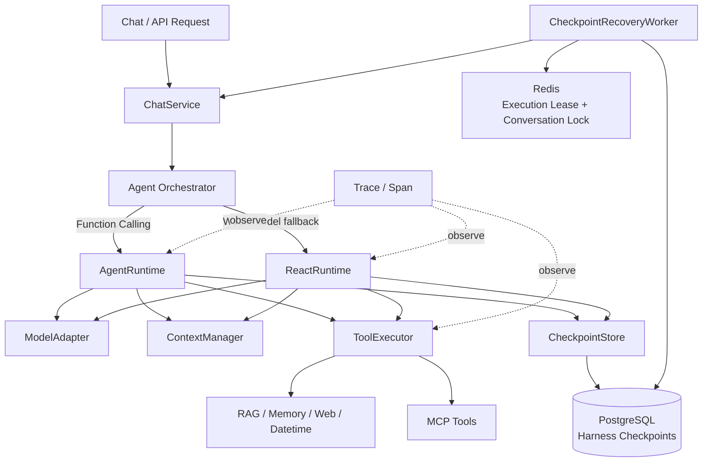
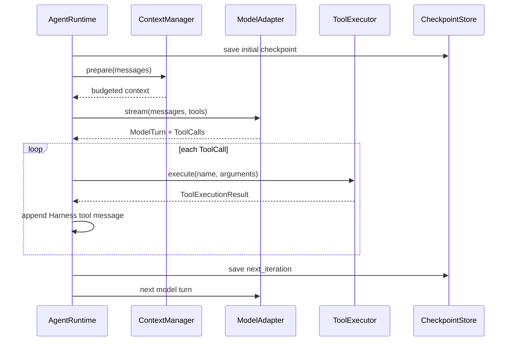
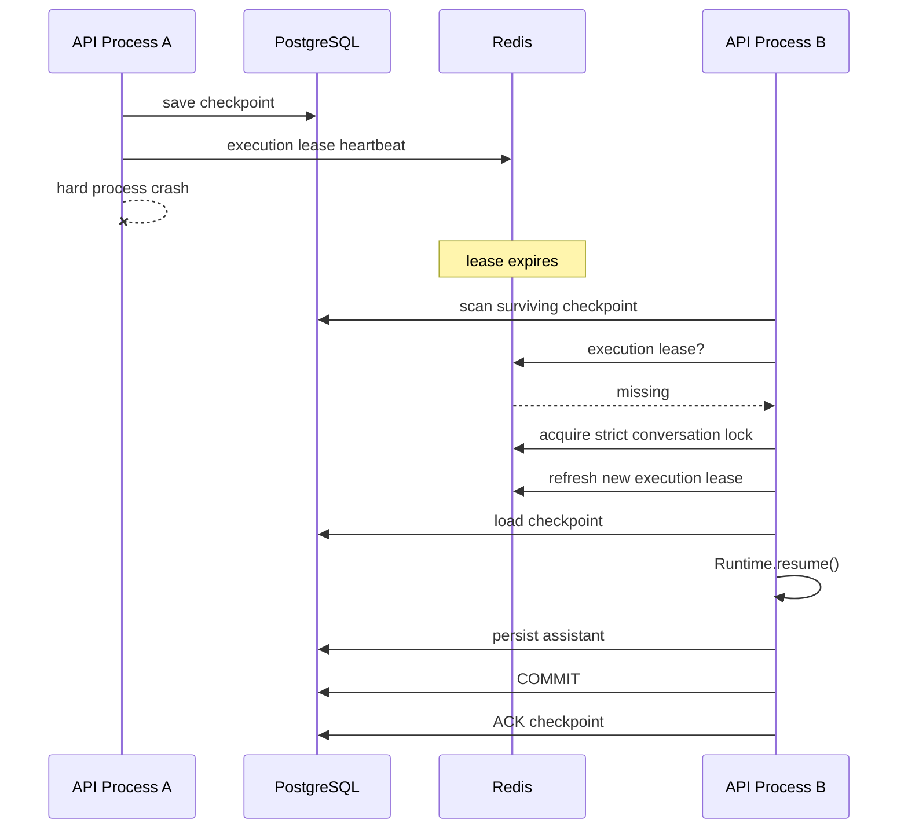

# Comet Agent Harness / Runtime Architecture

> `feature/harness` 分支的 Agent 执行基础设施设计说明。

## 1. 项目定位

Comet 原本是一套个人 AI 知识库与记忆助手，包含 RAG、长期记忆、联网搜索、MCP、深度研究等能力。

`feature/harness` 在这些产品能力之上继续演进，重点把 Agent 的执行控制从框架内部抽离出来，形成由项目自身维护的 **Agent Harness / Runtime**。

目标不是重新实现模型框架，而是让 Harness 自己掌握：

- Agent 多轮执行循环
- Function Calling / ReAct 双运行时
- 模型适配层
- 工具执行入口
- Context Budget / Compaction
- Checkpoint / Resume
- Durable Business ACK
- Process Crash Recovery
- Trace / Trajectory
- 后续 Harness Eval / Benchmark

LangChain 仍保留在模型和工具生态的适配边界，但 Agent Loop 的控制权已经进入 Harness Runtime。

---

## 2. 总体架构



---

## 3. Harness 目录

```text
api/app/core/harness/
├── adapters/
│   └── LangChain Model Adapter
├── runtime/
│   ├── contracts.py
│   ├── agent_runtime.py
│   └── react_runtime.py
├── tools/
│   └── executor.py
├── context/
│   ├── estimator.py
│   └── manager.py
├── checkpoint/
│   ├── models.py
│   ├── store.py
│   ├── codec.py
│   └── postgres_store.py
└── recovery.py
```

核心设计原则：

```text
Framework Integration
        ↓
Adapter / Tool Boundary
        ↓
Harness-owned Execution
```

而不是把完整执行生命周期交给一个不可控的框架 Agent Loop。

---

## 4. Runtime Contracts

Harness 定义自己的统一运行时对象：

```text
HarnessMessage
ToolCall
ModelUsage
ModelTurn
ModelStreamEvent
ModelAdapter
ExecutionContext
```

Runtime 因此不需要直接依赖 LangChain 的 `HumanMessage`、`AIMessage`、`ToolMessage` 等具体消息类型。

模型生态发生变化时，优先修改 Adapter，而不是重写 Runtime。

---

## 5. Function Calling Runtime

强模型路径由 `AgentRuntime` 驱动。



`AgentRuntime` 负责：

- 驱动模型多轮执行
- 接收标准化 `ToolCall`
- 调度统一 `ToolExecutor`
- 将工具结果回灌 Harness Context
- 控制最大迭代次数
- 保存 / 恢复 Checkpoint
- 输出统一事件流

---

## 6. ReAct Runtime

弱模型无法稳定使用原生 Function Calling 时，使用 `ReactRuntime`。

模型输出类似：

```text
Thought: ...
Action: memory_search
Action Input: 用户喜欢什么音乐
```

Runtime 解析 `Action` / `Action Input`，调用相同的 `ToolExecutor`，再把结果转换为：

```text
Observation: ...
```

并进入下一轮模型调用。

因此 Function Calling 与 ReAct 主要只在模型交互策略上不同，Tool Runtime、Context、Checkpoint 和 Trace 等基础设施可以共享。

---

## 7. Tool Runtime

两个 Runtime 共用 `ToolExecutor`。

当前执行链：

```text
Tool Lookup
    ↓
Run-local Cache
    ↓
Tool Invocation
    ↓
Error Capture
    ↓
Result Formatting
    ↓
Statistics
    ↓
Latency
    ↓
Tracing
    ↓
ToolExecutionResult
```

当前工具来源包括：

```text
Built-in
├── Knowledge / RAG
├── Memory
├── Web Search
├── Datetime
└── Scheduled Task

External
└── MCP Tools
```

RAG、Memory、Web 和 MCP 在 Harness 中是可调度能力，而不是 Agent Loop 的所有者。

---

## 8. Context Management

多轮 Agent 会不断累积：

```text
User
Assistant ToolCall
Tool Result
Assistant ToolCall
Tool Result
...
```

`ContextManager` 在每次真正调用模型前进行上下文预算控制，当前重点包括：

- Token Budget
- Message Compaction
- Tool Call / Tool Result 原子块保护
- 超长 Tool Result 截断
- Context 统计

观测字段包括：

```text
original_messages
final_messages
original_tokens
final_tokens
dropped_messages
dropped_blocks
truncated_tool_messages
compacted
over_budget
```

这样 Runtime 不需要把无限增长的完整历史直接交给模型。

---

## 9. Checkpoint Abstraction

Checkpoint 层采用：

```text
CheckpointStore Protocol
        │
        ├── InMemoryCheckpointStore
        └── PostgresCheckpointStore
```

Runtime 只依赖 Protocol，不直接依赖 SQLAlchemy。

生产环境的 PostgreSQL Store 绑定当前 `user_id`，并在 load / delete 时同时校验 `checkpoint_id + user_id`，维持多租户边界。

---

## 10. Initial Checkpoint

Runtime 在第一轮模型调用之前建立初始 Checkpoint：

```text
request accepted
      ↓
initial checkpoint(next_iteration=0)
      ↓
first model invocation
```

因此即使进程在第一轮模型请求期间硬崩溃，新进程仍然知道该 turn 存在未完成的 Harness execution。

---

## 11. Checkpoint Boundary

Function Calling 当前采用：

```text
Iteration N
    ↓
Model produces complete ToolCall batch
    ↓
execute Tool 1
execute Tool 2
...
    ↓
append complete Tool Result batch
    ↓
save checkpoint(next_iteration=N+1)
```

ReAct 采用类似边界：

```text
Action
    ↓
Tool
    ↓
Observation
    ↓
append Action + Observation
    ↓
save checkpoint(next_iteration=N+1)
```

因此，**已经进入持久化 Checkpoint 的完整工具批次，在 Resume 后不会再次执行。**

---

## 12. Resume

Checkpoint 保存：

```text
runtime kind
next_iteration
Harness messages
accumulated text
user input
max iterations
metadata
```

新 Runtime 可以：

```text
load checkpoint
      ↓
reconstruct ExecutionContext
      ↓
start from next_iteration
      ↓
continue normal run()
```

而不是从最初用户问题完整重放所有已经 durable 的步骤。

---

## 13. Durable ACK Boundary

仅仅 Runtime 正常返回，还不能代表一次聊天业务已经真正完成。

如果流程是：

```text
Runtime final
      ↓
delete checkpoint
      ↓
process crash
      ↓
assistant message never committed
```

恢复状态就会丢失。

因此生产聊天链路采用：

```text
Runtime completion
      ↓
checkpoint remains
      ↓
assistant message INSERT
      ↓
PostgreSQL COMMIT
      ↓
business ACK
      ↓
delete checkpoint
```

也就是说：

> **assistant 的 durable business result 才是 Checkpoint 的 ACK 边界。**

---

## 14. ACK Crash Window

还存在一个相反窗口：

```text
assistant COMMIT success
       ↓
process crashes
       ↓
checkpoint delete not executed
```

此时数据库会同时存在：

```text
completed assistant
+
stale checkpoint
```

Recovery Worker 在恢复前先检查对应 assistant 是否已经持久化。如果已经完成，则：

```text
DO NOT regenerate
      ↓
only delete stale checkpoint
```

从而避免重复回复。

---

## 15. Process Crash Recovery

生产运行时维护 Redis execution lease：

```text
running API process
      ↓
heartbeat
      ↓
refresh execution lease
+
refresh conversation lock
```

如果发生 `os._exit`、进程 kill、容器崩溃等硬故障，`finally` 无法执行，但 Redis lease 会在 TTL 后自然消失。

新的 API 进程中的 `CheckpointRecoveryWorker` 周期扫描 PostgreSQL。



---

## 16. Fail-closed Recovery

Recovery 涉及多个 API Worker 时，错误恢复比暂时不恢复更危险。

因此协调逻辑采用 fail-closed 思路：

```text
cannot prove exclusive ownership
        ↓
do not automatically resume
```

目标是降低多个 Worker 同时接管同一个 turn 的概率。

---

## 17. Ordinary Exception vs Hard Crash

普通 Python 异常和真正的进程硬崩溃语义不同。

普通异常能够进入 `except / finally`，业务层会给对应 checkpoint 写入：

```text
auto_recover = false
last_error = ...
```

用于避免永久业务错误形成后台无限 retry storm。

真正的硬进程崩溃来不及写该标记，因此 checkpoint 保持可恢复状态，等待 execution lease 过期后由新进程接管。

---

## 18. Observability

Harness Runtime 和 Tool Runtime 接入统一 Trace / Span。

LLM Span 重点记录：

```text
model
iteration
input tokens
output tokens
cached tokens
messages count
context tokens
context compaction
tool calls count
response preview
```

Tool Span 重点记录：

```text
tool name
query
status
latency
output chars
output preview
error
```

因此一次 Agent 执行不仅有最终回答，还可以下钻到完整执行轨迹。

---

## 19. Recovery Verification

`api/tests` 中已有针对 Harness Recovery 的手工回归 / E2E 检查：

```powershell
uv run python tests\manual_checkpoint_resume_check.py
uv run python tests\manual_react_checkpoint_resume_check.py
uv run python tests\manual_postgres_runtime_resume_check.py
uv run python tests\manual_checkpoint_ack_check.py
uv run python tests\manual_checkpoint_recovery_worker_check.py
uv run python tests\manual_api_restart_recovery_e2e.py
```

覆盖范围：

| Test | 验证内容 |
|---|---|
| `manual_checkpoint_resume_check.py` | Function Calling checkpoint / resume |
| `manual_react_checkpoint_resume_check.py` | ReAct checkpoint / resume |
| `manual_postgres_runtime_resume_check.py` | PostgreSQL durable checkpoint |
| `manual_checkpoint_ack_check.py` | durable assistant → checkpoint ACK |
| `manual_checkpoint_recovery_worker_check.py` | Worker 请求重建和 stale ACK 清理 |
| `manual_api_restart_recovery_e2e.py` | 新 Python/API 进程自动接管硬崩溃状态 |

跨进程 E2E 使用真实 PostgreSQL / Redis、新 Python 进程和 FastAPI lifespan / Recovery Worker；模型执行使用 deterministic fake model，因此它验证的是 Harness 的 durable execution / process recovery，而不是外部 LLM Provider 的在线可用性。

---

## 20. 当前能够准确描述的保证

目前可以较准确地描述为：

```text
Checkpoint-level durable execution
+
cross-process crash recovery
+
completed tool-batch replay protection
+
durable business ACK
+
execution tracing
```

也就是：

> 完整工具批次已经进入 durable checkpoint 后，进程崩溃并恢复时不会重新执行该批次。

---

## 21. 当前不保证 Generic Exactly-once Tool Execution

当前仍存在 operation-level crash window：

```text
Tool RUNNING
      ↓
external side effect succeeds
      ↓
process crashes
      ↓
Tool Result has not been persisted
```

此时 Harness 无法仅通过 checkpoint 判断工具是没有执行、部分执行，还是已经在外部成功。

因此项目当前不宣称：

```text
generic exactly-once side effects
```

后续设计方向：

```text
Tool Execution Journal
+
stable execution / operation identity
+
idempotency policy
+
UNCERTAIN state
```

对于幂等 Tool 可以安全重试；对于支持 idempotency key 的下游，可以复用稳定 operation id；对于无法确认状态的非幂等 Tool，应 fail safe，而不是盲目自动重放。

---

## 22. Roadmap

```text
Completed
  ✅ AgentRuntime
  ✅ ReactRuntime
  ✅ ModelAdapter
  ✅ Unified ToolExecutor
  ✅ Context Budget / Compaction
  ✅ In-memory Checkpoint
  ✅ PostgreSQL Checkpoint
  ✅ Resume
  ✅ Durable ACK Boundary
  ✅ Redis Execution Lease
  ✅ Recovery Worker
  ✅ Cross-process Recovery E2E
  ✅ Trace / Trajectory

Next
  → Harness Eval / Benchmark
  → Unified Harness Regression Runner
  → Stable Execution Identity
  → Tool Execution Journal
  → Operation-level Recovery Policy
```

---

## 23. 项目来源与演进

本仓库：

```text
https://github.com/Jiusheng01/haeness
```

基于公开项目：

```text
https://github.com/lm041520/Comet
```

继续演进。

原有 RAG、Memory、知识库、搜索、深度研究等产品能力不是在 `feature/harness` 分支从零重新实现。

`feature/harness` 当前重点展示的是 Agent execution infrastructure 方向的重构与增强，包括 Runtime、Tool Runtime、Context Management、Checkpoint / Resume、Crash Recovery、Durable ACK 与 Observability。

在项目介绍和面试中应保持这一来源边界，不把 upstream 已有能力描述为本分支原创。
